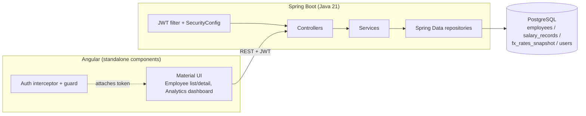

# Architecture

## Overview

Three-tier monolith: Angular SPA, Spring Boot REST API, PostgreSQL. No
microservices — at 10,000 employees the entire dataset is a few MB; splitting
this into services would add operational cost without solving any real
problem at this scale.

## Why this shape

- **Layered backend** (controller → service → repository): business logic —
  most importantly the salary-history transition in `SalaryRecordService`
  and the filter-branch logic in `EmployeeService` — is unit-testable with
  plain Mockito, no Spring context required. See `salary/src/test/java`.
- **PostgreSQL over SQLite**: SQLite satisfies the letter of "relational
  database of your choice," but Postgres is realistic prod, free-tier
  hostable (Neon/Supabase/Railway), and gives a real indexing story
  (`V2__seed_indexes.sql`) plus native `LATERAL` joins used by the analytics
  queries.
- **REST over GraphQL**: the query patterns are simple and known upfront
  (list+filter, get-by-id, a handful of aggregates). GraphQL would solve a
  flexibility problem this app doesn't have.
- **JWT over sessions**: the API and SPA are separately deployed processes
  (`docker-compose.prod.yml`); a stateless bearer token avoids sticky
  sessions or a shared session store.
- **No NgRx**: server state (employees, salary records, analytics) is
  fetched per-view via services returning Observables/signals. There's no
  complex cross-view client state to justify a state-management library.

## The key data-modeling decision: salary history is append-only

`salary_records` is never updated in place. `SalaryRecordService.createRecord`
closes the employee's current record (`end_date`) and inserts a new one in
the same transaction — see
`salary/src/main/java/com/acme/salary/salary/SalaryRecordService.java`. This
is what makes "how does the org pay people" answerable at all: trend-over-time
and an audit trail come for free, rather than needing a separate history
table bolted on later. It's tested directly in
`SalaryRecordServiceTest` (the transition logic) and
`SalaryRecordControllerIT` (end-to-end through the HTTP layer).

## Deliberate simplifications (and why)

| Decision | Reasoning |
|---|---|
| Static FX snapshot table, not a live rates API | Avoids an external dependency and its failure modes for a feature that's illustrative, not the product's core value. Documented in `REQUIREMENTS.md`. |
| `manager_id` left null in the seed data | Building a two-pass seed (assign managers only after all employees have IDs, respecting seniority ordering) adds real complexity for no analytics or grading benefit at this scope. |
| Email+password JWT, not SSO | Enough to demonstrate auth correctness (401 without a token, 200 with one, wrong-password rejection); SSO is infrastructure, not product logic. |
| Employee IDs use `IDENTITY` generation, not a pooled `SEQUENCE` | See `docs/PERFORMANCE.md` — a deliberate trade-off for a one-time seed script, not a hot path. |

## Testing strategy

- **Unit** (Mockito, no Spring context, milliseconds): the salary-history
  transition logic, employee filter branching, JWT generation/validation.
  `./mvnw test`.
- **Integration** (Testcontainers Postgres, real HTTP layer via MockMvc):
  auth gating, pagination/filtering, the transition logic end-to-end, and
  analytics aggregation correctness against a known fixture.
  `./mvnw verify`.
- **Frontend** (Vitest + Angular TestBed): component logic with mocked
  services — filtering/pagination calls, login success/failure, the auth
  interceptor, and salary-record form validation. `npx ng test`.

Frontend tests use Angular's built-in Vitest-based runner (`ng test`), which
current Angular CLI versions scaffold by default. This supersedes an earlier
plan to swap in Jest specifically to avoid Karma's real-browser requirement —
Vitest already satisfies that goal (no browser, fast, CI-friendly) without
adding a dependency the tooling didn't already provide.
